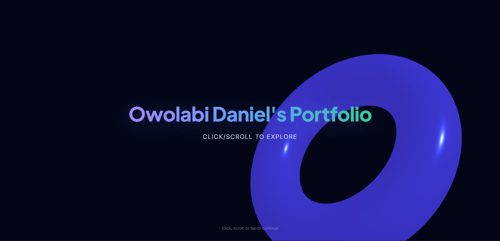
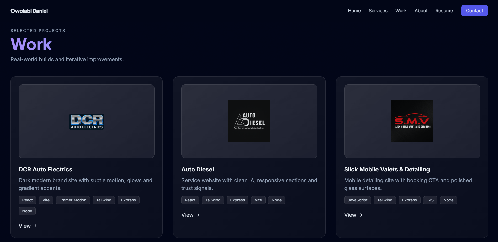
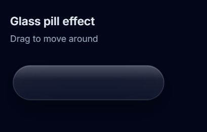
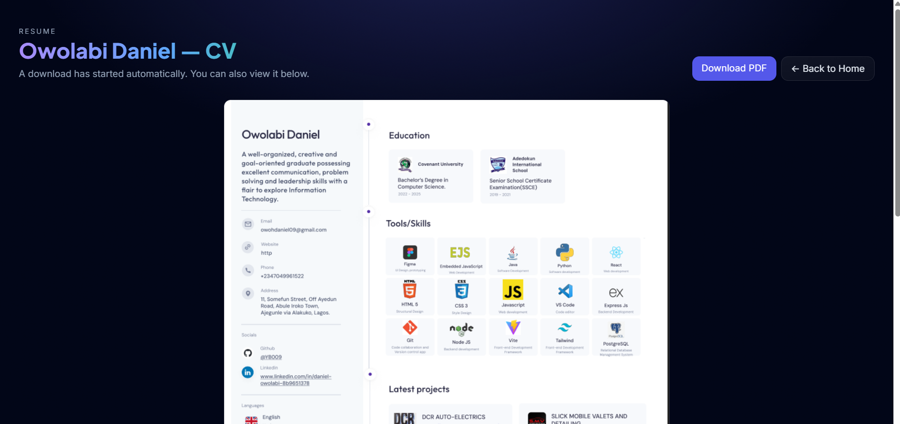
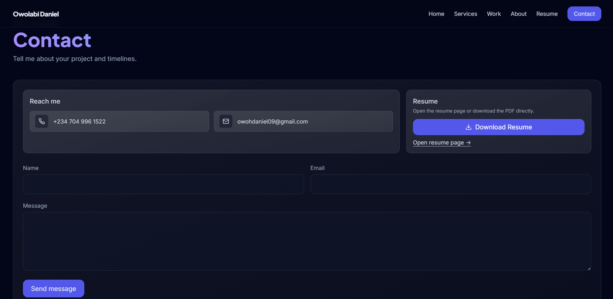

<!-- PROJECT HEADER -->
<h1 align="center">Dark Modern Portfolio</h1>
<p align="center">
  <i>A sleek, animated developer portfolio built with React (Vite), Tailwind CSS, Framer Motion, and an Express API.</i>
</p>

<p align="center">
  <a href="https://github.com/YB009/Portfolio"></a>
  
  
  
  
</p>

<p align="center">
  <a href="#-features">Features</a> •
  <a href="#-screenshots">Screenshots</a> •
  <a href="#-tech-stack">Tech Stack</a> •
  <a href="#-project-structure">Structure</a> •
  <a href="#-quickstart-local">Quickstart</a> •
  <a href="#-environment-variables">Environment</a> •
  <a href="#-deployment-on-render">Render Deploy</a> •
  <a href="#-api">API</a> •
  <a href="#-troubleshooting">Troubleshooting</a>
</p>

---

## ✨ Features

- **Dark, modern aesthetic** — soft gradients, depth, glow and glassmorphism.
- **3D Ring Loader** — stationary intro with  
  **“Owolabi Daniel’s Portfolio”** and **“Click/Scroll to explore.”**
- **Smooth motion** — tasteful section reveals & micro-interactions via Framer Motion.
- **Mobile-first navbar** — fixed, full-screen overlay with animated close icon.
- **Work grid with logos** — project cards link to live sites; tags for stack.
- **Liquid-Glass Pill** — draggable, refractive “glass” object that can move *anywhere* on the page.
- **Resume page** — dedicated route that auto-downloads your PDF and shows an inline preview.
- **Contact section**  
  - One-click **Copy** phone/email  
  - `mailto:` fallback  
  - Form posts to an **Express `/api/contact`** endpoint (Nodemailer + Gmail SMTP).
- **Smooth scrolling** — in-page navigation glides to each section.
- **Monorepo** — npm workspaces (`client` + `server`).

---

## 🖼 Screenshots

> Replace with your own images (store under `docs/`).

| Loader | Home | Work |
|:-:|:-:|:-:|
|  |  |  |

| Liquid Glass Pill | Resume | Contact |
|:-:|:-:|:-:|
|  |  |  |

---

## 🧰 Tech Stack

- **Frontend:** React (Vite), Tailwind CSS, Framer Motion  
- **Backend:** Express, Nodemailer  
- **Build/Deploy:** Render  
- **Other:** Smooth-scroll behavior, SPA fallback serving

---

## 🗂 Project Structure

```text
Portfolio/
├─ package.json                 # npm workspaces + root scripts
├─ README.md
├─ .gitignore
├─ client/                      # React + Vite + Tailwind
│  ├─ package.json
│  ├─ index.html
│  ├─ postcss.config.js
│  ├─ tailwind.config.js
│  ├─ vite.config.js
│  └─ src/
│     ├─ main.jsx, App.jsx, styles.css
│     ├─ assets/               # logos/images
│     ├─ data/                 # services + projects metadata
│     ├─ components/           # Navbar, Button, Card, Section, Socials, Marquee, etc.
│     └─ sections/             # Hero, Services, Work, About, Contact, Resume
└─ server/                      # Express API (contact form)
   ├─ package.json
   ├─ server.js                 # serves API + client build (SPA fallback)
   ├─ email-service.js          # Nodemailer transport + verification
   └─ .env.example              # SMTP template
```

---

## ⚡ Quickstart (Local)

```bash
# 1) Install workspaces
npm install

# 2) Start dev servers (Vite + Express)
npm run dev
# client: http://localhost:5173
# server: http://localhost:3001
```

### Configure Email (`server/.env`)

```env
PORT=3001
# Allowed origins if client runs separately (comma-separated)
# ORIGIN=http://localhost:5173

# Gmail SMTP — use an App Password (2FA must be enabled)
SMTP_HOST=smtp.gmail.com
SMTP_PORT=587
SMTP_SECURE=false
SMTP_USER=your@gmail.com
SMTP_PASS=your_gmail_app_password
MAIL_TO=your@gmail.com
```

> **Gmail App Password:** Google Account → Security → **2‑Step Verification** ON → **App passwords** → choose “Mail” → copy the 16‑char password into `SMTP_PASS`.

### Production (local)

```bash
# build client
npm run --workspace client build

# serve API + built client
npm run --workspace server start
# open http://localhost:3001
```

---

## 🔧 Environment Variables

| Key | Where | Example | Notes |
| --- | --- | --- | --- |
| `PORT` | server | `3001` | Render injects its own in prod. |
| `ORIGIN` | server | `https://your-static.onrender.com` | Comma‑separated list for CORS. Omit if serving same origin. |
| `SMTP_HOST` | server | `smtp.gmail.com` | Gmail SMTP host. |
| `SMTP_PORT` | server | `587` or `465` | `587` → `SMTP_SECURE=false` (STARTTLS); `465` → `true` (SSL). |
| `SMTP_SECURE` | server | `false` or `true` | Must match port pairing above. |
| `SMTP_USER` | server | `your@gmail.com` | Must be the same address used in `from`. |
| `SMTP_PASS` | server | `<app-password>` | Gmail App Password (not your normal password). |
| `MAIL_TO` | server | `your@gmail.com` | Recipient; defaults to `SMTP_USER`. |
| `VITE_API_URL` | client (optional) | `https://your-api.onrender.com` | Only needed if client & API are different origins. |

---

## ☁️ Deployment on Render

### Single service (API + SPA on the same URL)

**Build Command**
```bash
npm install && npm run --workspace client build && npm install --workspace server
```

**Start Command**
```bash
node server/server.js
```

**Environment**
```ini
NODE_VERSION=20
SMTP_HOST=smtp.gmail.com
SMTP_PORT=587        # or 465
SMTP_SECURE=false    # true if 465, false if 587
SMTP_USER=your@gmail.com
SMTP_PASS=<gmail app password>
MAIL_TO=your@gmail.com
```

The server statically serves `client/dist` and applies an SPA fallback for client‑side routes.

### Two services (Static + API)

**Static Site** (root: `client`)  
- Build: `npm install && npm run build`  
- Publish directory: `dist`  
- Env: `VITE_API_URL=https://<your-api>.onrender.com`

**Web Service** (root: `server`)  
- Build: `npm install`  
- Start: `node server.js`  
- Env: SMTP vars above + `ORIGIN=https://<your-static>.onrender.com`

---

## 🔌 API

### `GET /api/health`
Health check → `{ "ok": true }`

### `GET /api/test-email`
Server‑side transport verification; sends a test message using your SMTP config.  
Returns `{ "ok": true }` on success.

### `POST /api/contact`
```json
{
  "name": "Your name",
  "email": "you@example.com",
  "message": "Hi!"
}
```
Sends an email via Nodemailer; returns `{ "ok": true }`.

---

## 🧪 Dev Notes

- The contact form prefers a **relative** API base (`/api/contact`) by default, but respects `VITE_API_URL` if provided.
- The server includes:
  - request timing logs,
  - SMTP verification before send,
  - SPA fallback so `/about`, `/work`, etc. render from `index.html`.

---

## 🧯 Troubleshooting

**“Something went wrong. Try again.”**  
1) DevTools → **Network**: confirm the form posts to the correct URL (same‑origin in single‑service or your `VITE_API_URL` in two‑service).  
2) Render → **Logs** should show either success or a specific error (`EAUTH Invalid login`, `ETIMEDOUT`, etc.).  
3) Gmail: ensure **2FA is ON** and you’re using an **App Password** as `SMTP_PASS`.  
4) Port/secure pairing must be correct: **465/true** or **587/false**.

**“Cannot GET /”**  
Use the production start command: `node server/server.js` (not `vite`). The server serves the SPA.

**PDF not previewing**  
Keep the download button. Some browsers/extensions block inline PDF; the site provides both.

---

## 👤 Author

**Owolabi Daniel** — B.Sc. Computer Science, Covenant University (Nigeria).  
Full‑stack developer with 1+ year shipping:
- Production sites for startups & SMEs
- Booking flows and marketing sites
- Node/Express APIs with clean boundaries
- Accessible, high‑performance UIs (React + Tailwind)
- Design systems & micro‑interactions

- GitHub: <https://github.com/YB009>  
- LinkedIn: <https://www.linkedin.com/in/daniel-owolabi-8b9651378>  
- Email: <owohdaniel09@gmail.com>

---

## 📝 License

MIT © Owolabi Daniel. See [LICENSE](LICENSE) for details.
